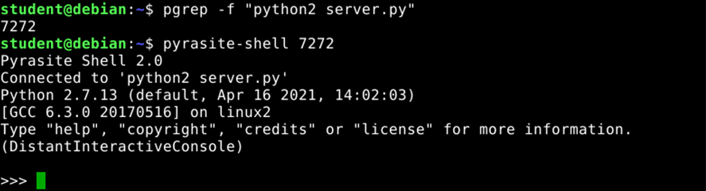
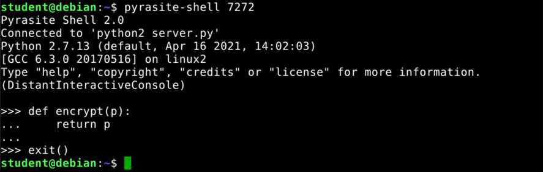
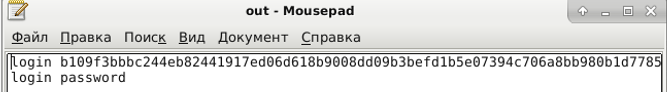

## Используемое ПО:
* `Debian 9.13 (stretch)`
* `Python 2.7`
* `pyrasite`

## Загрузка зависимостей
```bash
pip install pyrasite
```

## Выполнение работы
```bash
python2 server.py
nc localhost 10001
# До модфикации процесса
login password
# После модификации
login password
```

```bash
pgrep -f "python2 server.py"
>>> %pid%

pyrasite-shell %pid%
```

```python
# В режиме редактирования процесса модифицируем ф-ию
def ecrypt(p):
    # Убираем "защиту"
    return p
```

## Результат в файле out.txt
