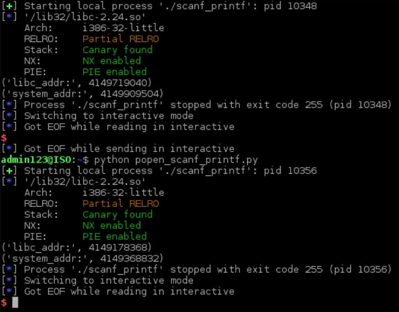

## Используемое ПО:
* `Debian 9.13 (stretch)`
* `Python 2.7`

Команда для поиска Адреса выхода
```shell
objdump -D /lib32//libc-2.24.so | grep exit
```
После чего передаем его
```shell
python popen_scanf_printf.py
```
## Возможный результат


### Примечание
Модифицированная версия лекции: `system offset` и слогаемое `payload`'e
заменяется на адрес `0xffffff`; Лаба работает через раз